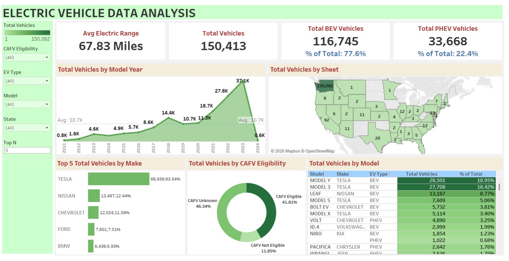

# ⚡ Electric Vehicle Dashboard 🚗📊

## 📌 Project Overview

This project presents an **interactive Tableau dashboard** analyzing Electric Vehicle (EV) population data to uncover trends, adoption patterns, and insights across regions, vehicle types, and manufacturers.

The goal of this project is to transform raw EV data into **actionable insights** using data visualization techniques, enabling better understanding of the growing EV landscape.

---

## 🎯 Objectives

- Analyze EV adoption trends over time
- Identify top manufacturers and vehicle models
- Compare Electric Vehicle types (BEV vs PHEV)
- Understand geographic distribution of EVs
- Build an interactive dashboard for dynamic exploration

---

## 🛠️ Tools & Technologies

- **Tableau** – Dashboard creation & visualization
- **CSV Dataset** – Electric Vehicle population data
- **Data Cleaning** – Tableau Prep / Excel (if applicable)

---

## 📂 Dataset

The dataset used contains information such as:

- Vehicle Make & Model  
- Electric Vehicle Type (BEV / PHEV)  
- Model Year  
- State / County  
- Electric Range  
- CAFV Eligibility  

---

## 📊 Dashboard Features

### 🔹 Key KPIs
- Total Electric Vehicles
- Average Electric Range
- Distribution by EV Type

### 🔹 Visualizations
- EV Adoption Trends (Year-wise)
- Top Manufacturers & Models
- Geographic Distribution Map
- EV Type Comparison (BEV vs PHEV)

### 🔹 Interactivity
- Filters by Year, Make, Model, and Location
- Drill-down capabilities for deeper insights

---

## 📈 Insights & Findings

- Significant growth in EV adoption over recent years
- Certain manufacturers dominate the EV market
- BEVs are more widely adopted compared to PHEVs
- Urban regions show higher EV concentration

---

## 🚀 How to Use

1. Download the `.twbx` file from this repository  
2. Open it in **Tableau Desktop / Tableau Public**  
3. Interact with filters and dashboards to explore insights  

---

## 📸 Dashboard Preview

•⁠  ⁠

---

## 📌 Future Improvements

- Add forecasting for EV adoption trends  
- Integrate real-time or updated datasets  
- Enhance dashboard design with advanced storytelling  
- Include cost and environmental impact analysis  

---

## 🤝 Contribution

Feel free to fork this repository and improve the dashboard or analysis. Contributions are always welcome!

---

## 📬 Contact

If you have any questions or feedback, feel free to connect!

